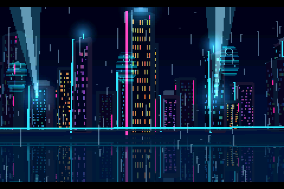
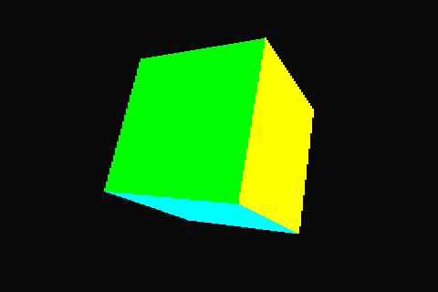
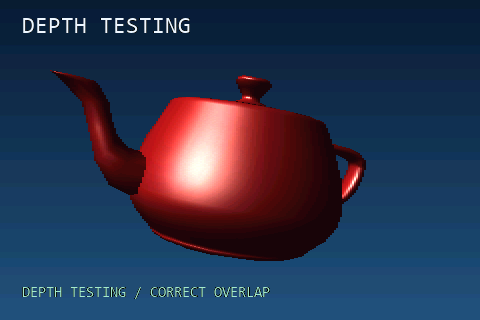
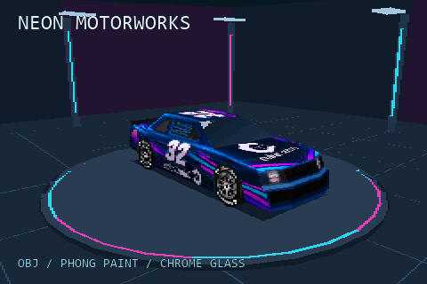
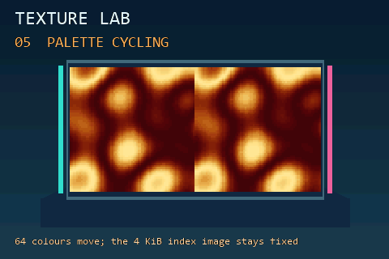
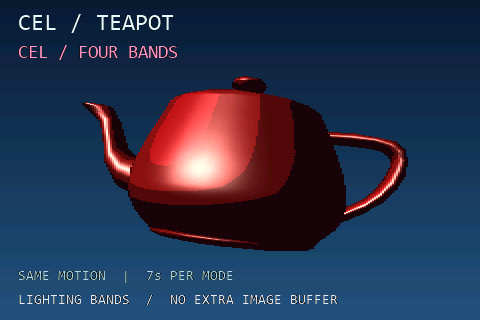
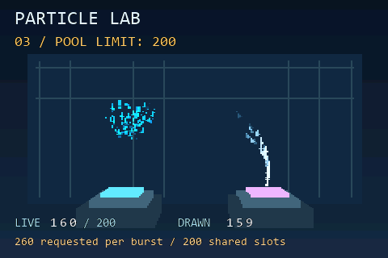
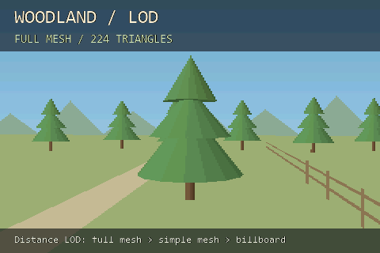
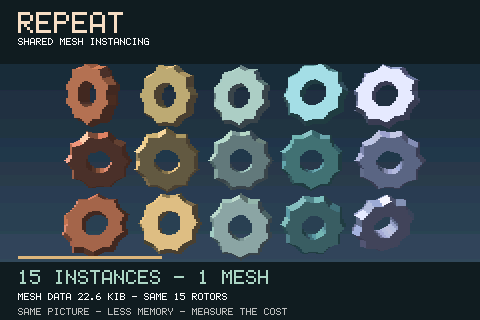

# Jet examples for ESP32

Sixteen standalone ESP-IDF projects showing what [Jet](https://github.com/CubeCoders/Jet),
a software 3D renderer, can do on an ESP32-S3. Start with a rotating cube, explore
individual rendering techniques, or run the two complete demoscene showcases.
Each example has its own scene and renderer configuration, while sharing the
optimized ESP32 display, DMA scanout and frame-pacing runtime.

The screenshots below use **ESP32-level visuals**: 480×320 output, half-width
RGB565 rendering, paired interlaced fields and each example's hardware settings.
They are native software captures at a fixed pose, with the performance overlay
hidden—not higher-resolution desktop renders or photographs of an LCD.

## Complete showcases

| ESP 88 | MATTER |
| --- | --- |
| [](esp32-neon-film/README.md) | [](esp32-matter/README.md) |
| **[ESP 88](esp32-neon-film/README.md)** — A two-minute neon city cinematic: rain, river reflections, an autonomous coupe, a police pursuit and a hover-car escape. Combines Phong highlights, environment mapping, glow sprites, particles, LOD and scene asset changes. | **[MATTER](esp32-matter/README.md)** — A three-minute procedural art exhibition. Ten moving installations explore metal, folded paper, chrome, colour, botanical spirals and ceramic forms through analytic deformation, lighting, texture mapping and composition. |

Both showcases deliberately reboot after their closing fade to begin a new loop.
They run entirely on the ESP32; there is no prerecorded video playback.

## Feature examples

Click a screenshot or title for the example's instructions, implementation notes
and measured hardware results. Every directory is a separate ESP-IDF project.

| | |
| --- | --- |
| [](esp32-template-cube/README.md)<br>**[Rotating cube](esp32-template-cube/README.md)**<br>Minimal project: scene setup, camera, coloured geometry and the shared ESP32 runtime. | [](esp32-lighting-teapot/README.md)<br>**[Utah teapot lighting](esp32-lighting-teapot/README.md)**<br>Flat, Gouraud and glossy Phong lighting on the same mesh and matched motion. |
| [](esp32-textured-boxes/README.md)<br>**[Textured crate](esp32-textured-boxes/README.md)**<br>Affine versus perspective-correct mapping, nearest versus bilinear sampling, and a practical 128×128 texture. | [](esp32-tropical-island/README.md)<br>**[Tropical island](esp32-tropical-island/README.md)**<br>Sky gradient, rippled water, previous-field reflections, additive sun sprites and occluded lens flares. |
| [](esp32-depth-teapot/README.md)<br>**[Depth comparison](esp32-depth-teapot/README.md)**<br>Painter sorting versus a depth buffer: overlap correctness, render time and memory cost. | [](esp32-neon-car/README.md)<br>**[Neon Motorworks](esp32-neon-car/README.md)**<br>Runtime OBJ/MTL loading, indexed textures, glossy paint and environment-mapped windows. |
| [](esp32-texture-features/README.md)<br>**[Texture Lab](esp32-texture-features/README.md)**<br>Wrap, clamp and zero addressing, colour-key transparency, palette cycling and texture LOD. | [](esp32-postfx-crt/README.md)<br>**[CRT / Arcade](esp32-postfx-crt/README.md)**<br>Toggle physical-row scanlines without allocating another image buffer. |
| [](esp32-postfx-cel/README.md)<br>**[Cel / Teapot](esp32-postfx-cel/README.md)**<br>Quantized lighting bands compared with smooth shading, without another image buffer. | [](esp32-particles/README.md)<br>**[Particle Lab](esp32-particles/README.md)**<br>Additive sparks, gravity-driven spray, alpha fades, fixed-pool limits and distance culling. |
| [](esp32-sprites-blending/README.md)<br>**[After Hours](esp32-sprites-blending/README.md)**<br>Additive glow meshes and sprite halos, translucent layers and mirrored-mesh floor reflections. | [](esp32-sprite-controls/README.md)<br>**[Air Mail](esp32-sprite-controls/README.md)**<br>Sprite flips, per-material/per-sprite alpha, motion echoes, letterboxing and screen fades. |
| [](esp32-lod-billboards/README.md)<br>**[Woodland](esp32-lod-billboards/README.md)**<br>Distance-driven mesh simplification, billboard stand-ins and transition fading. | [](esp32-mesh-instancing/README.md)<br>**[REPEAT](esp32-mesh-instancing/README.md)**<br>Immutable shared geometry: 93.3% less mesh storage here, with complexity-dependent CPU tradeoffs. |

## Build and run

Use **ESP-IDF 6.0.x** (validated with **6.0.1**), Git, and an ESP32-S3 with PSRAM.
Open an ESP-IDF terminal so its compiler and Python environment are active.
The tested S3 has 8 MiB PSRAM and 8 MiB flash. The repository also includes
ESP32-P4 SPI-display defaults; P4 support has compilation checks, while the
showcase performance and visual reviews are from S3 hardware.

```sh
git clone --recurse-submodules https://github.com/CubeCoders/JetExamples.git
cd JetExamples/esp32-template-cube

idf.py -B build-s3 "-DIDF_TARGET=esp32s3" "-DSDKCONFIG=sdkconfig.s3" build
idf.py -B build-s3 "-DIDF_TARGET=esp32s3" "-DSDKCONFIG=sdkconfig.s3" -p PORT flash monitor
```

Replace `PORT` with your device, such as `COM6` on Windows or `/dev/ttyACM0` on
Linux. Exit the serial monitor with **Ctrl+]**. To run another example, change
into its directory and use the same commands. The firmware build uses checked-in
assets and generated headers; Pillow, a model exporter and desktop graphics
libraries are not required.

If you cloned without submodules, run this from the repository root:

```sh
git submodule update --init --recursive
```

Keep the repository layout intact. All examples reference `../components`; use
the pinned submodule revisions instead of updating dependencies independently.
The LovyanGFX submodule uses CubeCoders' fork with the required DMA optimizations.

### Configure your board and display first

**Test hardware:** a dual-core **ESP32-S3 at 240 MHz**, **8 MiB octal PSRAM at
80 MHz**, and a **320×480 ST7796 SPI LCD at 80 MHz**, rotated to **480×320
landscape**. These are the settings behind our performance figures.

The display configuration belongs to this repository's
[`components/esp32_jet/Board.hpp`](components/esp32_jet/Board.hpp). It constructs
the LovyanGFX SPI bus, panel and backlight; you do not need to edit LovyanGFX's
library source for ordinary wiring changes.

| Setting | Where to change it |
| --- | --- |
| SCLK, MOSI, D/C, CS, reset and backlight GPIOs | `Board::clock`, `mosi`, `dc`, `cs`, `reset`, `backlight` in `Board.hpp` |
| SPI clock and mode | `b.freq_write`, `b.freq_read` and `Board::spiMode` in `Board.hpp` |
| LCD controller | `lgfx::Panel_ST7796` in `Board.hpp`; select the appropriate LovyanGFX panel class |
| Panel dimensions, offsets, inversion and RGB/BGR order | `p.panel_width`, `p.panel_height`, `p.offset_*`, `p.invert`, `p.rgb_order` in `Board.hpp` |
| Backlight polarity and PWM | The `light.config()` block in `Board.hpp` |
| Landscape orientation | `tft.setRotation(3)` in [`Display.cpp`](components/esp32_jet/Display.cpp) |
| Output dimensions | `SCREEN_WIDTH` and `SCREEN_HEIGHT` in [`Display.hpp`](components/esp32_jet/Display.hpp), plus the scene's projection/layout |
| Flash size, PSRAM type/speed and CPU clock | The selected example's `sdkconfig.defaults*`, or `idf.py ... menuconfig` |

Reference wiring is **not universal ESP32 wiring**:

| Signal | S3 GPIO | P4 GPIO |
| --- | ---: | ---: |
| SCLK | 46 | 20 |
| MOSI | 3 | 5 |
| D/C | 8 | 23 |
| CS | 17 | 7 |
| Reset | 18 | 8 |
| Backlight | 9 | 21 |

No MISO or buttons are required. Connect power and ground according to your
module and LCD board's requirements. S3 uses SPI mode 1; P4 uses mode 0.
The S3 fast scanout requires a **dedicated SPI2 bus** and owns its DMA completion
interrupt. Do not share that bus with an SD card, touch controller or another
display task. Moving to another SPI peripheral requires adapting the scanout
implementation as well as the LovyanGFX bus setting.

Choose a write clock supported by your actual LCD, board and wiring. **A slower
display will not achieve the same performance.** At 480×320, even alternating
rows require almost 74 Mbit/s of pixel data for 60 fields/s before command
overhead. A 40 MHz SPI link cannot sustain that rate. Rendering optimizations
cannot remove the time needed to transmit pixels to the panel.

The scenes and their labels are authored for 480×320. A different resolution
also needs adjustments to camera projection, UI coordinates, gradient arrays
and any fixed viewport assumptions in the example; changing the panel dimensions
alone is insufficient. For a different interface such as RGB parallel or DSI,
replace the SPI scanout integration—the supplied P4 path is also SPI.

For a module with different flash or PSRAM, configure it before flashing:

```sh
idf.py -B build-s3 "-DIDF_TARGET=esp32s3" "-DSDKCONFIG=sdkconfig.s3" menuconfig
```

The S3 defaults select octal PSRAM at 80 MHz and 8 MiB flash. Generated
`sdkconfig.s3` settings take precedence over defaults; editing a defaults file
does not update an already-generated configuration. Keep separate configuration
and build files for each target. The P4 equivalent is:

```sh
idf.py -B build-p4 "-DIDF_TARGET=esp32p4" "-DSDKCONFIG=sdkconfig.p4" build
idf.py -B build-p4 "-DIDF_TARGET=esp32p4" "-DSDKCONFIG=sdkconfig.p4" -p PORT flash monitor
```

P4 defaults select 360 MHz CPU and 200 MHz PSRAM; adapt those to your hardware.

## Rendering and performance

The normal output is 480×320. 3D pixels are rendered at half width and duplicated
horizontally; each field renders alternating rows. Two 240×160 RGB565 buffers
use **153,600 bytes total**. Full-resolution sprites and labels are composited
during scanout. At 60 fields/s, each individual LCD row refreshes at 30 Hz.

Core 1 renders while core 0 scans out the previous field. On S3, an eight-row
DMA queue and SIMD pixel expansion leave time for an adaptive second raster
worker. P4 uses ping-pong scanlines, explicit cache flushing and direct DMA.
Absolute frame deadlines, measured animation time and idle-task recovery retain
stable pacing and the watchdog. The runtime falls back when the queued S3 path
is unavailable.

Simple scenes aim for 60 fields/s; the richer showcases can run around 35–40
fields/s in demanding sections. Geometry, screen coverage, lighting, textures,
depth testing, memory placement and display bandwidth all affect the result.
Each example's `VALIDATION.md` records what was measured; the screenshots make
no frame-rate claim.

Feature examples show **FPS / MS / TRIS / TRI/S** on hardware. ESP 88 and MATTER
show only a small rounded FPS number. The documentation captures hide this overlay.

- **FPS:** completed render fields per second, sampled over at least 0.5 seconds.
- **MS:** elapsed scene-render time, including setup, raster workers and registered
  render effects; excludes animation, sprite compositing, scanout waits and pacing.
- **TRIS:** unique rasterized triangles after culling/clipping, including triangles
  hidden by depth testing; it is not a visible-pixel count.
- **TRI/S:** total rasterized triangles divided by measured render time, not by
  the complete paced frame time. It describes this workload, not a theoretical peak.

Painter sorting is the default where the geometry permits it. The lighting and
cel teapots use depth testing for their overlapping surfaces; the depth example
explicitly compares both approaches. REPEAT demonstrates memory savings from
instancing, with measured complexity-dependent performance rather than a fixed
instance-count threshold.

## Make your own example

Copy [`esp32-template-cube`](esp32-template-cube/README.md), change its CMake
project name, and replace `main/Cube.hpp`. Keep the shared repository structure:

```text
components/
  Jet/                 renderer submodule
  LovyanGFX/           display-driver submodule
  esp32_jet/           board, scanout, field buffers and frame runtime
cmake/                 shared ESP-IDF dependency setup
esp32-template-cube/   minimal starting project
esp32-*/               one ESP-IDF project per example
docs/screenshots/      ESP32-style captures for documentation
tools/screenshots/     reproducible native screenshot renderer
tests/                 shared runtime and renderer checks
```

`Esp32Jet::start(init, update)` creates the scene and calls your update with
elapsed seconds. Optional callbacks support post-render effects and sprite
updates. Keep objects, materials and texture data alive while rendering and
scanout use them. The template README explains the runtime contract.

Each example supplies `main/firmware/JetConfig.hpp`. Feature switches control
what is compiled into that project; runtime material settings choose among the
enabled capabilities. Keep the same configuration across every translation unit.
The provided CMake files arrange this. The shared runtime requires field buffers
and does not support its checkerboard/single-buffer alternatives.

## Host checks and screenshots

With CMake and a C++17 compiler (use a developer prompt for MSVC):

```sh
cmake -S tests -B build-tests -DCMAKE_BUILD_TYPE=Release
cmake --build build-tests --config Release
ctest --test-dir build-tests -C Release --output-on-failure
```

Most examples also have a `tests` directory for their own preview and correctness
checks. [Screenshot instructions](tools/screenshots/README.md) cover regenerating
the gallery. The [capture manifest](docs/screenshots/manifest.json) records poses,
renderer settings and image hashes. The [screenshot collection](docs/screenshots/README.md)
contains one selected frame per example, ready for reuse in Jet's documentation.

## Licence and assets

Example code is [MIT licensed](LICENSE). Jet and LovyanGFX retain their own
licences. Third-party and supplied artwork retains its documented provenance:
see the [teapot](esp32-lighting-teapot/assets/README.md),
[crate](esp32-textured-boxes/assets/README.md), and
[car assets](esp32-neon-car/assets/README.md). The code licence does not override
separate artwork rights. ESP 88's car/city and MATTER's geometry are original
procedural work.
