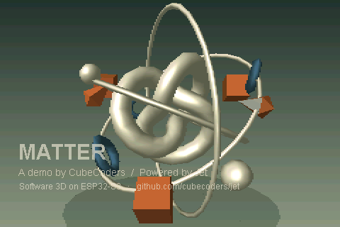

# MATTER

A three-minute procedural art exhibition, rendered live by Jet on ESP32-S3.
No city, vehicles, story or synthwave palette: ten kinetic installations explore
cast metal, concrete, paper, chrome, primary colour, botanical form, woven ink,
crystal and ceramic. This is inspired by the procedural art of 64K intros; the
firmware is not claimed to be a 64K executable.

| Time | Movement | Construction |
|---|---|---|
| 0:00–0:18 | Pressure | Phong-lit cogwheels with smooth rounded bevels, counter-rotation, moving pistons |
| 0:18–0:36 | Counterweight | Travelling brutalist nave, phased concrete slabs |
| 0:36–0:54 | Paper Weather | Folding sine landscape and articulated paper birds |
| 0:54–1:12 | Quicksilver | Analytically deformed chrome, live reflection UVs |
| 1:12–1:30 | Colour in Space | Suspended rings, rhythmic slats, primary colours |
| 1:30–1:48 | Botanica | Golden-angle leaves, breathing helix, warm spore glows |
| 1:48–2:06 | Interference | Close-up twisting striped ribbons and larger beads inside the spiral |
| 2:06–2:24 | Reliquary | Growing mineral forms and reflective central crystal |
| 2:24–2:42 | The Gyre | Travelling counter-rotating ceramic tunnel surrounding a foreground golden knot |
| 2:42–3:00 | Matter | An orbital assemblage, title and final fade |

The last frame is black, followed by one second of black and a deliberate
reboot. All scene geometry is released at each movement; small procedural
textures and type masks remain alive for the complete loop. Between scene cuts,
animation does not allocate memory. Native preview tools allocate their own
output and verification buffers. The exhibition is silent.

The project shares the examples repository's ESP32 scanout, field buffers,
parallel rasterization, frame pacing and small top-right numeric FPS overlay.
Firmware uses painter ordering with opt-in precise triangle bucket sorting;
no depth buffer. Broad surfaces avoid thin-line aliasing on the half-width LCD.
Reflection textures approximate a studio environment; they are not ray tracing.

Build like the other examples with ESP-IDF and the shared components. Native
rendering: `cmake -S tests -B build-preview`, build, then `ctest --test-dir
build-preview --output-on-failure`. `matter_preview` produces a contact sheet;
pass seconds and an output PPM path for a particular frame. The video tool in
`tools/render_video.py` makes an S3-layout preview at fixed 60 Hz; encoded video
frame rate is not a claim about measured device performance.

Mesh rotations use 34–53 degrees/second on exposed axes to keep Jet's integer
Euler steps from reading as slow jitter. Small tilt changes are held fixed or
animated briskly. The camera retains smooth floating-point angles. Pale scenes
use dark captions. Only a small numeric FPS counter appears at the upper right
on hardware; the video does not fabricate a hardware counter.

The opening's rings occupy separate shells around a compact gear cluster, with
the pistons outside their sweep. Counterweight's cubes rotate below the lintels
and inside the columns. Quicksilver's suspended assembly clears its plinth, and
its beads orbit between the deformed core and the inner hoop. These clearances
are authored into the motion; they do not depend on enabling a depth buffer.
Colour in Space separates the rotating bars behind the rings, with the spheres
and rising slats in front; all solid pairs stay clear throughout the animation.
The Gyre's golden knot uses low ambient fill and a strong directional key for
curved shading and moving Phong highlights. Its outward face winding matches
the smooth lighting normals, as does the porcelain knot in the finale.

For a desktop-quality export, build `tests/quality` into `build-quality` and
pass `--quality` to the video tool. That target uses full 2880×1920 colour and
depth buffers, bilinear perspective textures, and outputs 1920×1280 video.
Firmware uses the same scene definitions with the S3's packed buffers.

See [VALIDATION.md](VALIDATION.md) for hardware measurements and checks.

Research: [Farbrausch's procedural tools presentation by Dirk Jagdmann](https://llg.cubic.org/docs/farbrauschDemos/)
and [fr-019: poem to a horse](https://demozoo.org/productions/26236/).
All demo geometry, textures and motion are original procedural work. Typography
is baked from a supplied local font; see `tools/prepare_type.py` to regenerate.
