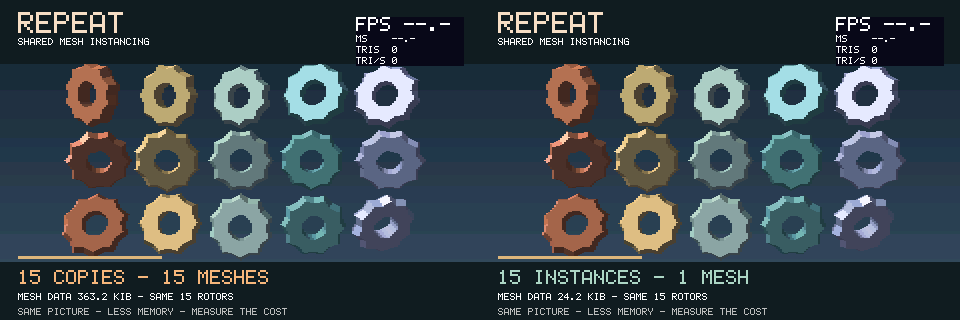

# REPEAT: shared mesh instancing

Fifteen glossy, coloured rotors alternate every eight seconds between independent
mesh copies and instances of one immutable mesh. The geometry, colours, lighting
and motion match. Watch the mesh-storage figure change while the picture stays
the same.

**Use instancing to save memory, and budget for a small CPU overhead.** Sharing
vertices, triangles and their position cache makes repeated props much cheaper to
store. Jet still transforms and rasterizes every placement; it also composes an
instance transform and resolves material overrides. This is a storage feature,
not a promise of higher FPS. With enough reuse, better cache locality can outweigh
that overhead. This particular scene demonstrates that favourable case; see the
[measured scaling results](VALIDATION.md).

Repetition count alone is not a useful threshold: four of these larger rotors
already benefit, while 15 simple cubes gain very little. Mesh complexity,
lighting work and the order in which geometry is reused all matter. Flat
lighting still uses normals; unlit/emissive paths skip that work.



This native preview uses the S3's field layout and RGB565 colours. Its counters
are deliberately unmeasured. The memory labels reflect the desktop ABI; the S3
uses smaller pointers and triangle records.

## What the comparison measures

Each rotor contains 400 vertices and 200 triangles. Both modes submit 3,000
logical triangles in 15 independently positioned, coloured and culled Objects.
Backface culling reduces the rasterized count. Phong shading and precise painter
sorting stay enabled; no depth buffer is allocated.

On the S3, **mesh payload drops from 348,000 to 23,200 bytes**: about 340 to 23 KiB,
a **93.3% reduction**, saving 317.2 KiB. `MESH DATA` counts allocated vertex,
triangle and index capacity plus packed positions and their reuse map. It excludes
Object/instance metadata, allocator overhead, textures, framebuffers, render
queues and labels. It is not a whole-application RAM counter. The serial log also
reports live PSRAM use and free internal RAM after each switch.

The copy phase explicitly gives each rotor its own packed position cache as well
as its own vertex/triangle arrays. Ordinary `Object` copies already share the
packed cache; this example deliberately compares fully independent meshes with
full mesh sharing. The temporary authoring mesh is destroyed before measuring.
Only the active representation remains allocated.

The upper-right overlay shows completed field FPS, render MS, rasterized TRIS and
render-time TRI/S. At low object counts the 60-field display cap hides CPU savings,
so use render time when comparing. Samples immediately after a switch can mix
both modes. Rendering includes clear, transform, clipping, sorting and both
raster workers; it excludes animation, sprite compositing, scanout and pacing.

## Reuse the pattern

Set `JET_MESH_INSTANCING=1` in the `JetConfig.hpp` used by **every** translation
unit. It defaults to zero, preserving the existing renderer path and Object
layout in other examples. Rebuild all users when changing this capability.

```cpp
// All referenced materials and the Objects must outlive their use by Scene.
Renderer::Object authored = makeRotor();
auto mesh = Renderer::Object::freezeMesh(std::move(authored));

Renderer::Object rotor;
if (!rotor.addInstance(mesh, {}, &paint)) {
    // Reject invalid/nested prototypes or malformed per-triangle overrides.
    std::abort();
}
rotor.calculateBoundingBox();
scene.addObject(&rotor);

// The geometry remains immutable; the owner supplies animation.
rotor.setPosition(0, 0, 200);
rotor.setRotation(10, 20, 90);
```

`makeRotor()` is this example's procedural mesh authoring helper. Repeat the owner
creation with the same `mesh` for independently animated props. Alternatively,
add several instances to one owner using `Object::InstanceTransform::rotated()`
and different local positions. That entire batch is culled together, so avoid
combining props scattered across a large world into one owner.

The prototype and optional per-triangle material table are reference counted.
Materials and their textures remain borrowed: keep them alive. The uniform
material override takes precedence; null entries in a per-triangle table retain
the original material/baked colour. An override replaces baked lighting too.

Freeze only finished, static geometry. Instance matrices support rigid rotations
and reflections, not scale or shear; bake scale into a prototype first. Recompute
the owner's bounds after adding or moving local instances. Animate the owner
without recalculating mesh data. Vertex/UV deformation needs separate geometry.
Nested instance batches are rejected. See [Jet's API guide](../components/Jet/docs/instancing.md).

## Build and validate

From this directory with ESP-IDF 6.0.x:

```sh
idf.py -B build-s3 "-DIDF_TARGET=esp32s3" "-DSDKCONFIG=sdkconfig.s3" build
idf.py -B build-s3 "-DIDF_TARGET=esp32s3" "-DSDKCONFIG=sdkconfig.s3" -p PORT flash monitor
```

Use the [template wiring](../esp32-template-cube/README.md). Keep the repository
layout intact. P4 defaults are included, but this example has only been built and
measured on S3 hardware.

With CMake and a C++17 compiler (a developer prompt for MSVC):

```sh
cmake -S tests -B build-preview -DCMAKE_BUILD_TYPE=Release
cmake --build build-preview --config Release
ctest --test-dir build-preview -C Release --output-on-failure
```

The tests write `instancing.ppm`, `copies.ppm` and `instances.ppm`, check identical
scene pixels and serial/parallel rendering, and exercise prototype release during
repeated switches. A separate renderer configuration checks texture mapping,
triangle sorting and picking with shared geometry. See [validation](VALIDATION.md).

All visible geometry and labels are generated in code; no external art assets or
model files are required. Example code and generated preview are MIT licensed.
