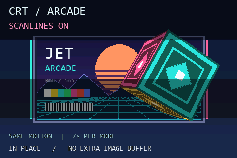

# CRT / Arcade



A bright arcade test card and spinning textured cube compare Jet's in-place CRT
scanlines. The effect switches off/on every **seven seconds**. Cube motion repeats
exactly in each interval, giving a 14-second comparison loop. Fine lines, colour
bars, gradients and moving edges make the effect visible.

`POSTFX_CRT=1` makes the effect available. `scene.crtEnabled` switches it at runtime;
`scene.crtIntensity=112` dims alternate physical display rows by about 44%.
Intensity 0 leaves them unchanged, 255 makes them black. RGB565 channels scale by
the same fraction, avoiding the colour cast of subtracting identical values
from channels with different bit depths.

The effect modifies the existing render field in place, after both raster workers
finish. It allocates **no additional image or row buffer**. This is scanline
darkening, not a simulation of CRT curvature, phosphor persistence or bloom.
The physical odd rows stay dark on both fields: packed row indices must not be
used to choose scanline parity. Even fields need no CRT pixel pass.

Labels and counters are composited afterwards at full LCD resolution. FPS counts
displayed fields; MS includes the CRT pass; TRI/S uses actual scene render time.
The shared serial report's non-raster timing includes post processing as well as
scene preparation, despite its historical `setup` label. Compare MS over a full
mode interval because the pass runs on only one of the two field parities.

All materials are unlit; nearest affine textures and painter ordering keep this
comparison inexpensive. The backdrop is in the background render band and the
convex cube in the normal band. There is no depth buffer. The shared ESP32 DMA
scanout, pacing and parallel raster code are unchanged.

## Build and check

From an ESP-IDF 6.0.x terminal in this directory:

```sh
idf.py -B build-s3 "-DIDF_TARGET=esp32s3" "-DSDKCONFIG=sdkconfig.s3" build
idf.py -B build-s3 "-DIDF_TARGET=esp32s3" "-DSDKCONFIG=sdkconfig.s3" -p PORT flash monitor
```

Use the [template's reference wiring](../esp32-template-cube/README.md).
P4 defaults are included; only S3 hardware is validated here.

With CMake and a C++17 compiler (developer prompt for MSVC):

```sh
cmake -S tests -B build-preview -DCMAKE_BUILD_TYPE=Release
cmake --build build-preview --config Release
ctest --test-dir build-preview -C Release --output-on-failure
```

Six tests cover the scene, both field parities, full/half-width and packed-field
layouts, compile-time disabling, intensities, odd output heights, guards,
runtime toggles and serial/parallel rendering. `crt-preview.ppm` shows two matched
poses with scanlines off and on; its counters are placeholders.

Assets and immutable label headers are checked in. Regenerate with Pillow:
`python tools/prepare_assets.py`, optionally supplying `--font path/to/font.ttf`.
See [hardware validation](VALIDATION.md) for measurements.
