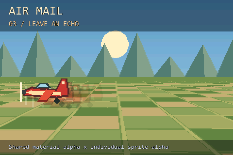

# Air Mail



A red mail plane flies over a sunlit patchwork of fields and distant hills.
The countryside is simple unlit 3D geometry; the aircraft is one original
64x32 colour-keyed RGB565 sprite, drawn at 2x scale at full LCD resolution.
No depth buffer, lighting pass or post-processing buffer is required.

The 28-second loop spends seven seconds on each technique:

| Stage | What changes |
| --- | --- |
| Change direction | FLIP_X turns the aircraft around when it changes direction. |
| Fly inverted | FLIP_Y turns it upside down, independently of horizontal direction. |
| Leave an echo | Four delayed copies share an animated material alpha, multiplied by each sprite's individual alpha. |
| Cinematic exit | Solid rectangle bars slide in, then a full-screen black rectangle fades out and back in. |

Every plane copy references the same immutable 4 KiB texture. No pre-flipped
images or trail framebuffer are allocated. Echo positions are sampled from
earlier points on the flight path; these are deliberately simple afterimages,
not a motion blur effect. Transparent source pixels use black as the colour key.

Sprite order places echoes behind the plane, followed by bars and the fade.
Captions and performance counters stay above the fade so the demonstration
remains readable even at full black. The floor and crop plots use the stable
background band in a deliberate order; this is an authored landscape rather
than a general terrain engine. The camera gently sways while field rows scroll.

FPS, MS, TRIS and TRI/S use the shared runtime. MS and triangle counts describe
the 3D world; the full-resolution plane, echoes, captions and fade are composed
during scanout. Sprite work therefore affects FPS and serial scanout timing,
but does not increase the world triangle count or render MS. This distinction
is particularly visible during the full-screen fade.

Sprites support normal alpha blending and additive blending. The other
Object blend equations are 3D features and remain a separate example; this
project does not imply those equations work on Sprite2D.

## Build

From an ESP-IDF 6.0.x terminal in this directory:

```sh
idf.py -B build-s3 "-DIDF_TARGET=esp32s3" "-DSDKCONFIG=sdkconfig.s3" build
idf.py -B build-s3 "-DIDF_TARGET=esp32s3" "-DSDKCONFIG=sdkconfig.s3" -p PORT flash monitor
```

Use the [template wiring](../esp32-template-cube/README.md). P4 defaults are
included; hardware verification for this example is on S3.

## Preview and checks

With CMake and a C++17 compiler:

```sh
cmake -S tests -B build-preview -DCMAKE_BUILD_TYPE=Release
cmake --build build-preview --config Release
ctest --test-dir build-preview -C Release --output-on-failure
```

Checks cover both flips and their combination on the actual aircraft artwork,
stage boundaries, a complete fade, packed-field buffer guards, and eight
serial/parallel render-and-sprite composites. `courier.ppm` shows two views of
each stage. Preview counters are placeholders.

Regenerate artwork and captions using Pillow and `python tools/prepare_assets.py`;
an optional `--font` argument selects a TrueType font.
See [assets](assets/README.md) and [hardware validation](VALIDATION.md).
