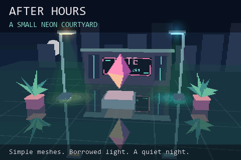

# After Hours — a small neon courtyard



A warm/cool pair of lamps, a late-night cafe, planters and a slowly rotating
faceted sculpture demonstrate how simple blending can suggest expensive lighting
and reflections. Everything is authored as small unlit meshes. The camera sweeps
across the courtyard, moving closer and rising and falling so the mirrored floor
follows the changing view. Its 14-second path spans X +/-360, Y 415-545 and
Z -1190 to -1010, looking towards the sculpture at (0, 135, 90).

The 42-second loop opens with the complete scene for 14 seconds, then spends
seven seconds on each step: bare geometry, mirror floor, additive light meshes,
and the finishing sprite halos. On-screen captions explain the construction;
FPS, MS, TRIS and actual-render TRI/S stay visible.

## The tricks

**Glossy floor:** each reflected subject has a duplicate mesh with vertex Y and
normal Y inverted, triangle winding reversed, and position reflected about Y=0.
The rotating sculpture's reflected pitch is negated while yaw is preserved.
Reflections render first, then a large floor quad blends its teal material over
them at alpha 158/255. About 38% of the reflected colour survives. The real
objects draw afterwards, so they cover the floor and their own reflections.
The skyline and moon are intentionally excluded from the mirror set.

This costs duplicated geometry and raster work, but no reflection image buffer,
screen-space lookup or real reflection calculation. It is a planar mirror trick,
not roughness-filtered reflections. All reflected subjects stay above the floor.
The floor extends past the camera's view so mirrored objects do not leak around
its visible edges.

**Fake spotlights:** five nested additive discs beneath each lamp build a pool of
warm or cool light. Two faint cone meshes suggest dust catching the beam. Their
colours brighten the existing floor using `ShadingMode::ADDITIVE`; no actual
light source, shadow map or volumetric scattering is evaluated. The meshes use
plain colours and per-material alpha, so there is no light-cookie texture.

**Soft lamp heads:** a full-resolution additive `Sprite2D` is projected onto each
lamp head. Each 32x32 halo is stored as a 16x16 top-left quarter, expanded with
`MIRROR_X | MIRROR_Y` and displayed at 2x scale. That makes a 64x64 visible glow
from 512 bytes of RGB565 storage. Falloff and tint are baked into the texture;
the existing sprite additive mode does not scale nonzero source intensity by
alpha. The camera path keeps lamp heads unobscured, so no visibility query is
needed for these screen-space halos.

## Layering and limits

Painter rendering is used throughout, with no depth buffer. The skyline, mirror
copies, translucent floor and seams occupy the engine's stable background band,
in that explicit order. Light pools follow the floor. Actual objects and beam
cones use the ordinary depth-sorted painter band. Halos, translucent caption
strips and text then composite at full LCD resolution.

This is an authored effect for a controlled camera arc. It is not a general
solution for arbitrary intersecting transparent geometry or moving through the
floor. Mirror objects have a stable back-to-front object order; a full camera
orbit or a different layout may require revised ordering or clipping.

No engine or shared-runtime changes were required. MS measures scene rendering;
the final full-resolution sprite pass occurs during scanout and is reflected
in FPS/scanout cost rather than render MS. TRIS includes mirrored meshes, floor,
light pools/cones and ordinary geometry, but not scanout sprites.

This example deliberately focuses on useful visual tricks. General sprite flips,
animated fades and the other 3D blend equations remain separate showcase work.

## Build and inspect

From an ESP-IDF 6.0.x terminal in this directory:

```sh
idf.py -B build-s3 "-DIDF_TARGET=esp32s3" "-DSDKCONFIG=sdkconfig.s3" build
idf.py -B build-s3 "-DIDF_TARGET=esp32s3" "-DSDKCONFIG=sdkconfig.s3" -p PORT flash monitor
```

Use the [template reference wiring](../esp32-template-cube/README.md). P4 defaults
are included; hardware validation here is on S3.

With CMake and a C++17 compiler (developer prompt for MSVC):

```sh
cmake -S tests -B build-preview -DCMAKE_BUILD_TYPE=Release
cmake --build build-preview --config Release
ctest --test-dir build-preview -C Release --output-on-failure
```

The native test checks mirror positions/winding, floor-layer differences,
additive-only brightening, separate sprite halos, packed-field guards,
serial/parallel equivalence and stage transitions. It emits `courtyard.ppm`,
with four views around the camera path and the four construction steps.
Preview performance counters are placeholders.

Generated headers and source artwork are checked in. Regenerate with Pillow and
`python tools/prepare_assets.py`, optionally providing `--font path/to/font.ttf`.
See [asset notes](assets/README.md) and [hardware validation](VALIDATION.md).
