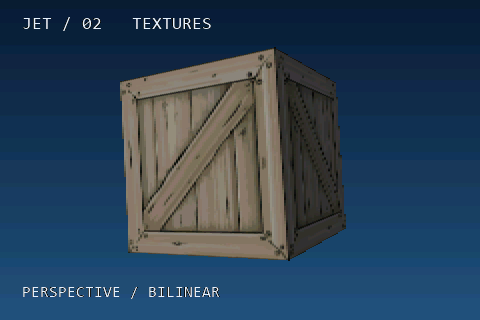

# 02 - Texture mapping and filtering



A plain 200-unit cube (12 triangles, 24 face vertices) spins close to the camera
at 65 degrees/second with faster rocking. All six faces use one shared 128x128
crate texture. The bright blue background, field FPS, triangle count and
effective triangles/second are supplied by the same runtime as the teapot.

The example cycles every three seconds:

| Mode | UV mapping | Texture sampling |
| --- | --- | --- |
| 1 | Affine | Nearest |
| 2 | Perspective-correct | Nearest |
| 3 | Affine | Bilinear |
| 4 | Perspective-correct | Bilinear |

Watch the diagonal timber brace and planks: affine interpolation can bend at
the triangle boundary as the cube turns. Perspective correction keeps the
texture aligned with depth. Bilinear sampling smooths enlarged texels, at the
cost of four samples and interpolation; it is not mipmapping or edge antialiasing.

The source is Cpt_Flash's CC0 [Wooden Box](https://opengameart.org/content/2d-wooden-box).
See [asset details](assets/README.md). Its diagonal and wood grain provide a
practical comparison on a pure cube; there is no extra crate geometry.

## Build capabilities and per-object choices

`TEXTURE_MAPPING=1`, `PERSPECTIVE_CORRECT_TEXTURES=1` and `BILINEAR_FILTER=1`
make both optional features available. `material.perspectiveCorrect` chooses
UV mapping per material, while `texture.bilinear` chooses filtering per texture.
Each defaults to its build option, retaining the old defaults. Setting a runtime
flag cannot enable code excluded by a build option. Bilinear filtering currently
applies to direct RGB565 textures; palette-indexed textures use nearest sampling.
The material flag affects UVs; Phong-normal interpolation follows the build setting.

Flat face lighting and back-to-front painter buckets are enabled. The single
convex cube needs no depth buffer; `Z_BUFFERING=0` and `FAST_Z=1` avoid
per-pixel depth work and the 153,600-byte depth allocation.
The 32 KiB crate texture is copied from flash into internal DRAM once at startup
and shared by all four texture descriptors. If allocation fails, sampling falls
back to the flash source. No extra image buffer is allocated when switching modes. Model rotation continues across switches;
counter samples can briefly include both modes around a transition.

## Build and validate

From an ESP-IDF 6.0.x terminal in this project:

```sh
idf.py -B build-s3 "-DIDF_TARGET=esp32s3" "-DSDKCONFIG=sdkconfig.s3" build
idf.py -B build-s3 "-DIDF_TARGET=esp32s3" "-DSDKCONFIG=sdkconfig.s3" -p PORT flash monitor
```

Use the [reference wiring](../esp32-template-cube/README.md). P4 defaults are
included, but this showcase has only been flashed and measured on S3.

```sh
cmake -S tests -B build-preview -DCMAKE_BUILD_TYPE=Release
cmake --build build-preview --config Release
ctest --test-dir build-preview -C Release --output-on-failure
```

The preview writes `boxes.ppm` with all four modes at the same pose. Its FPS
overlay deliberately remains unmeasured; hardware measurements come from the S3.
Tests cover mode timing, guard pixels, mapping/filter choices and analytic UV
reference samples. [Validation record](VALIDATION.md).

The shared overlay shows field FPS, mean render MS, TRIS and render-time TRI/S.
TRI/S uses summed triangle counts divided by summed render time, excluding
scanout waits and pacing; MS includes scene setup and both raster workers.
